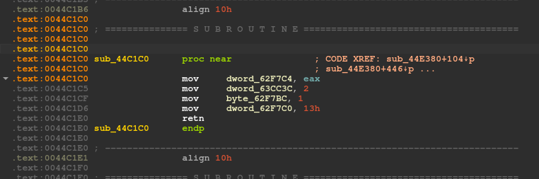

# vvvvvv-ida-includes

This is a collection of pseudo-C headers for use with IDA in order to ease updating VVVVVV's autosplitter.

## Maintaining

As of the last time this README has been updated, these headers support VVVVVV 2.4.1 specifically. If you are coming here and the current version of VVVVVV is not 2.4.1, you will need to update the class definitions in the `include/vvvvvv` folder to reflect changes made to them since then.

## How to use

After loading VVVVVV's executable into IDA, navigate to `File->Load file->Parse C header file...` in the menu and load `include/windows.h` if you are working on the Windows autosplitter file for LiveSplit, or `include/linux.h` if you are updating the Linux autosplitter for use with [pyautosplit](https://github.com/christofsteel/pyautosplit).

## Variables to search for

The Windows and Linux autosplitters use different names to identify internal VVVVVV variables, and in IDA you will be searching for the following:

### Windows

| LiveSplit.VVVVVV.asl          | Internal VVVVVV variable        |
|-------------------------------|---------------------------------|
| `gametimeFrames`              | `game.frames`                   |
| `gametimeSeconds`             | `game.seconds`                  |
| `gametimeMinutes`             | `game.minutes`                  |
| `gametimeHours`               | `game.hours`                    |
| `fadetomode`                  | `fadetomode` (Input.cpp)        |
| `gotomode`                    | `gotomode` (Input.cpp)          |
| `timetrialcountdown`          | `game.timetrialcountdown`       |
| `finalStretch`                | `map.finalstretch`              |
| `gamestate`                   | `game.state`                    |
| `firstTextLineSmall`          | `script.txt._Myfirst->_Bx._Buf` |
| `firstTextLineLarge`          | `script.txt._Myfirst->_Bx._Ptr` |
| `teleport_to_x`               | `game.teleport_to_x`            |
| `teleport_to_y`               | `game.teleport_to_y`            |
| `menustate`                   | `game.gamestate`                |
| `ingame_titlemode`            | `game.ingame_titlemode`         |

### Linux

TODO

## But how do I find all of this shit?

If you know what you're doing, it's pretty simple. If you *don't* know what you're doing though, fear not because I have you covered.

### Windows

The Windows VVVVVV executable is compiled with very minimal debug symbols so simply trying to search for things by name will be a fruitless endeavor. Thankfully, there's only a few key things you need to look for and the steps for finding them are mostly very similar.

#### The `Game` class instance

 Defined in `main.cpp` of the source code is an instance of the `Game` class called... `game`. It contains nearly everything relevant to the autosplitter's operation so this should be the first thing you track down. The steps I use to find this class instance are:

1. Perform a text search for `0BF4h`. This is 3060 decimal in IDA's hexadecimal notation, and corresponds to one of the game state IDs for rescuing Vermilion. This will hopefully pull up only one result that, although the symbol for it has been stripped, is inside the `Game::updatestate()` method.
2. In the IDA text view, go to the start of this method, right click on its name and select `List cross references to...` and pick any of them. It really doesn't matter which you pick because what we care about is an instruction that will immediately precede the instruction the cross ref takes you to, which will be a `mov ecx, unk_[gibberish hex digits]`instruction loading the `this` reference to the class into the ECX register. Double click on the operand and rename the address it takes you to `game`. You've now found the `Game` class instance, yay!
3. From the toolbar, navigate to `Open subviews->Local types` and find the listing for the `Game` structure. Double click it to pull up the import dialog and confirm the import.
4. Going back to the text view, select the address you renamed to `game` and hit Alt+Q to pull up the structure variable definition window. Set this address to the `Game` type.

After all this, you now have both found the `Game` class and have easy visibility of the addresses of the relevant variables it contains.

#### The `scriptclass` class instance

Also defined in `main.cpp` is an instance of the `scriptclass` class named `script`. We only really care about this class because it gives us a convenient method for splitting on the "Hello!" textbox in the credits sequence so let's get to work.

1. Perform a text search for `textboxtimer` and pick the search result that looks something like `push offset aTextboxtimer ; "textboxtimer"`. This will put you inside of the `scriptclass::run()` method which, again, does not actually have a symbol marking it as such in the Windows executable.
2. In the IDA text view, go to the start of this method, right click on its name and select `List cross references to...` and pick any of them. Once again, it doesn't matter which because we just care about an instruction that's immediately before the code referencing this method, namely another `mov ecx, unk_[gibberish hex digits]`instruction which loads the `this` reference to the class. Double click on the operand and rename the address it takes you to `script`.
3. From the toolbar, navigate to `Open subviews->Local types` and find the listing for the `scriptclass` structure. Double click it to pull up the import dialog and confirm the import.
4. Going back to the text view, select the address you renamed to `script` and press Alt+Q to pull up the structure variable definition window. Set this address to the `scriptclass` type.

What we specifically care about with this class is the `txt` variable, which is an `std::vector<std::string>` and more specifically we care about the `_Myfirst` variable contained within the `std::vector` class which is a pointer to the first element of the vector. The Visual Studio 2010 implementation of the `_String_val` class that `std::basic_string` (which `std::string` is an alias of) inherits from looks something like this:

```cpp
template <class _Elem, class _Alloc>
class _String_val : public _Container_base
{
public:
  enum { _BUF_SIZE = 16 / sizeof(_Elem) < 1 ? 1 : 16 / sizeof(_Elem) };

  union _Bxty
  {
    _Elem _Buf[_BUF_SIZE];
    _Elem *_Ptr;
    char _Alias[_BUF_SIZE];
  } _Bx;

  // there's more here but it's irrelevant to the topic
};
```

This `_Bx` union contains both an array to store short strings (`_Buf`) and a pointer for allocating space for strings that cannot fit in the array (`_Ptr`), which is why there are both `firstTextLineSmall` and `firstTextLineLarge` pointer variables in the autosplitter and why they have different levels of indirection.

#### The `mapclass` class instance

Once again, `main.cpp` defines an instance of this class and calls it `map`. We only care about one variable in this class that lets us split on the halfway terminal in Final Level.

1. Perform a text search for `"Television Newsvel"` and pick the search result that looks something like `push offset off_[gibberish hex digits] ; "Television Newsvel"`. This will bring you inside `mapclass::initmapdata()` which as you may have guessed does not have a debug symbol inside the executable just like the other methods you've found.
2. In the IDA text view, go to the start of this method, right click on its name and select `List cross references to...` and go through them one by one until you find one that has a `mov ecx, offset byte_[gibberish hex digits` instruction right before the function call. Right click on the operand of this instruction and rename the address to `map`.
3. From the toolbar, navigate to `Open subviews->Local types` and find the listing for the `mapclass` structure. Double click it to pull up the import dialog and confirm the import.
4. Going back to the text view, select the address you renamed to `map` and press Alt+Q to pull up the structure variable definition window. Set this address to the `mapclass` type.

#### `gotomode` and `fadetomode`

Unfortunately for us, these two variables are not neatly bundled up inside of classes but instead are global scope. You're gonna have to get your hands a bit dirty. Start by performing a text search for `13h` and pick the search result that looks something like `mov dword_[gibberish hex digits], 13h`. This will hopefully bring you to something that looks like this:



If it did bring you to something like this, great! This is the `startmode()` function in `Input.cpp` and by cross-referencing with the source code we can glean the info we need:

```cpp
static void startmode(const enum StartMode mode)
{
    gotomode = mode;
    graphics.fademode = FADE_START_FADEOUT;
    fadetomode = true;
    fadetomodedelay = 19;
}
```

Because of how similar the assembly looks to the original source code we can safely assume that these operations are roughly 1-to-1. From this we can gleam that the first mystery address being modified is `gotomode` and the third is `fadetomode`, so go ahead and rename them to those names.

#### Fixing the addresses

The addresses listed in IDA do not actually match up with the addresses LiveSplit's autosplitter is going to need. To fix this, you'll need to subtract the program's base address from each address. In IDA, you can find this by scrolling up to the top of the disassembly, taking the first address in the listing, subtracting 0x1000 from it, and then subtracting the resulting number from every address you're putting into LiveSplit.
